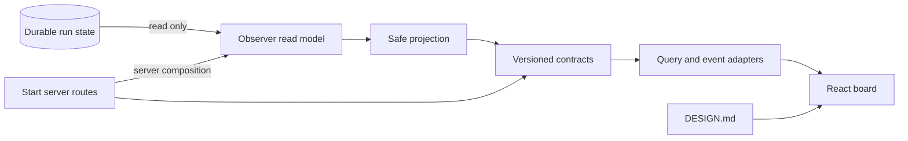

# Orbita Architecture

## Scope

This document is the architecture contract for the Orbita workflow-runner
runtime. It records layer ownership, dependency direction, retired surfaces,
conditional helper/schema zones, shard/fanout control steps, and review gates.

This contract covers `skills/orbita/**`. It does not define the dashboard visual
design; that remains in `DESIGN.md`.

## Supported Runtime Surface

The canonical workflow-runner command surface is:

- `next`
- `instructions`
- `write-output`
- `continue`
- API `listPointerTransitions` / CLI `list-pointer-transitions`
- API `movePointer` / CLI `move-pointer`

Validation and persistence behavior that supports these commands belongs to the
current runtime architecture. Orchestrator debug notes and worker binding are
bounded `continue` side effects; they do not navigate separately and do not
accept worker output. Obsolete backward-compatibility surfaces do not.

`instructions --step-id` dispatches from the current effective host action,
not from a prompt cached on an executable step. A current `run_worker` request
returns Template-compiled worker instructions. A current
`wait_for_approval` request returns the same dedicated approval projection used
by `next` and `continue`. A request superseded by an unresolved non-blocking
stop, a terminal response, or a missing/stale current request has no loadable
step instructions and must fail before lease renewal.

`listPointerTransitions` and `movePointer` are runner API control-plane recovery
surfaces for repositioning only the current baton pointer among state-bearing
workflow predecessors. Their shell-facing CLI modes are `list-pointer-transitions` and
`move-pointer`. Both require an active run lease. `listPointerTransitions` is a
logical read: it may use the run-state boundary for consistency, but it must not
initialize missing run state, append history, renew authority, or mutate the
baton/current pointer. It is not an unleased public read because it exposes
bounded pointer recovery metadata. `movePointer` mutates only
baton cursor/status through the existing lease, lock, validation, durable writer,
history, and per-run authority path. Neither surface rolls back, prunes, rewrites, or cleans
`baton.state`, accepted outputs, artifacts/results, worker bindings, prompt
markers, attempts, or existing history. A move may target any state-bearing
predecessor that reaches the current cursor through transitions resolved from
the current workflow and baton state; it must never offer a downstream or
state-less workflow step. Terminal
single-cursor positions, including a completed `done` run, may move backward to
a state-bearing non-terminal predecessor; terminal status must not by itself make pointer
recovery unsupported. Array cursors are rejected by the baton schema and cannot
enter pointer recovery.
Pointer moves preserve baton state without an extra acknowledgement gate.

Retired surfaces:

- `start-run`
- `persist-run-state`
- `workflow-interpreter`
- legacy command aliases
- compatibility wrappers whose only purpose is preserving obsolete paths

Retired surfaces must not remain in supported command paths, exports, docs, or
boundary-check allow lists.

## Custom Workflow Catalog

Custom workflow support is a runtime catalog feature for existing workflow
documents, not a plugin marketplace, visual editor, or autonomous workflow
rewriter. Built-in workflows remain the first-party root. User-provided
workflows are discovered from an Orbita TOML config at `~/.orbita/orbita.toml`
or `ORBITA_CONFIG`.

The supported config shape is:

```toml
[workflow_catalog]

[[workflow_catalog.roots]]
source_id = "team"
path = "~/orbita-workflows"
```

Many configured roots are allowed. They stack after the built-in root in config
order. `source_id` values are stable catalog identities and must not use reserved
ids such as `built-in` or `override`.

Catalog identity is source/path-qualified:

- `workflowRef = <sourceId>:<relativeWorkflowPath>`
- workflow `name` is display and fuzzy-routing metadata
- duplicate names are ambiguous unless an exact `workflowRef` is provided

`workflow-catalog --workflows-root <dir>` remains an isolated compatibility
override. It does not merge with built-ins or configured roots and uses the
reserved `override` source id.

Startup validation is non-bypassable for newly initialized runs. `workflow-runs
create` validates the selected workflow before writing a run-index entry, and
`workflow-runner next` validates before creating a missing lease/index/baton.
Runtime continuation must use the persisted absolute workflow path and must not
rediscover catalog/config roots.

Workflow resource loading is source-aware and bounded to the workflow package
root unless the workflow is built-in and explicitly allowed to use repository
role/template/shared material. Custom workflow names must not widen resource
access by basename.

Workflow-authoring/autotrain is an upstream producer only. Authored packages
become runtime-visible only after human-reviewed promotion into a configured
root or an explicit `--workflows-root` override. Runtime list/resolve/run code
must not import authoring/autotrain internals, scan staging locations, or promote
generated workflows implicitly.

## Layer Ownership

### Entrypoints

Owner: `lib/entrypoints/**`

Entrypoints are transport shells. They parse CLI/API input, coordinate IO with
persistence adapters, acquire or pass through leases where needed, call named
use-case APIs, and format public output.

Pointer recovery entrypoints must keep API and CLI behavior aligned: both
`listPointerTransitions` and `movePointer` require active lease authority, return
only bounded DTOs/errors, and redact lease tokens, token hashes, raw private
paths, raw baton dumps, and full private history text.

Entrypoints may depend on:

- named use-case APIs
- persistence adapters
- DTOs, request/response records, and transport-local schemas

Entrypoints must not depend on:

- `lib/use-cases/runtime/**` internals for stable behavior
- sibling entrypoint shells, including CLI-to-API imports
- entity internals except through approved use-case or DTO boundaries

### Use Cases

Owner: `lib/use-cases/**`

Use cases own application flow over DTOs and plain values. They call entity
owners and IO-free runtime helpers, then return DTOs, projections, or command
results to entrypoints.

Top-level use cases must not import other top-level use cases as a stable
pattern. Shared application policy belongs in a colocated helper or an internal
use-case helper zone only when multiple use cases need the same policy.

`ContinueRun -> ApplyWorkflowOutput` was migrated into an internal workflow-output
helper. Recurrence of top-level use-case-to-use-case imports must fail boundary
checks instead of becoming a stable pattern.

### Entities

Owner: `lib/entities/**`

Entities own workflow-domain invariants and behavior for concepts such as
Workflow, Step, Template, and Baton. Entities are IO-free and owner-isolated.

Entities must not import:

- persistence
- entrypoints
- filesystem/path APIs
- unrelated entity owner internals

`entities/Baton` owns Baton behavior. A durable Baton schema shared by multiple
layers is a file contract, not an entity behavior dependency for persistence.

### Runtime Helpers

Owner: `lib/use-cases/runtime/**` and `lib/runtime/**`

Runtime helpers are deterministic and IO-free. They operate over supplied
values, entities, DTOs, and supplied schema/path facts.

Executable-step records are neutral: they identify the normal step action and
execution context but do not carry `compiledPrompt` or any other rendered text.
One host-work projection combines each executable record with runner control
state to select the effective host action before rendering. An unresolved stop
for that request projects `resolve_non_blocking_stop`; otherwise the normal
`run_worker`, `wait_for_approval`, or terminal path remains effective.

Template owns worker instructions and is reachable only from the effective
`run_worker` branch. A colocated approval contract/projection owner selects a
producer-authored summary, ordered safe artifact metadata, and an optional
route-applicable current verdict, then renders the bounded human gate. Stop and
terminal projections remain separate from both Template and approval
selection. Removing either the host-work projection or approval owner would
duplicate effective-action selection or the closed approval contract across
`next`, `continue`, `instructions`, and output acceptance, so both zones pass
the deletion test without requiring a renderer hierarchy.

Runtime helpers must not import:

- `node:fs`
- `node:path`
- persistence modules
- workflow-resource loaders

The host-work projection must additionally not import entrypoints, Template,
command builders, or output-schema loaders. Approval, stop, and terminal
projection must not import Template or output-schema loaders. Entrypoints must
not dispatch renderer internals.

Output validation in runtime helpers consumes loaded schemas and explicit path
facts. Schema loading, realpath probing, symlink checks, and artifact path facts
belong to adapters or file-contract owners.

Pointer transition projection belongs under runner-owned runtime/use-case
internals, not the dashboard. It derives state-bearing predecessors by resolving
workflow transitions against the persisted baton and must be shared by list and move
validation so inspect-before-mutate output cannot drift from mutation rules.

Non-blocking stop helpers under `lib/runtime/**` own public shaping and
redaction of stop/resolution records. They must receive path facts from the
caller and must not discover workflow-run storage through persistence imports.

Shard runtime helpers own IO-free activation projection, shard output application, bounded batching, and final-worker readiness. They may consume
Workflow, Step, Baton, file contracts, loaded output schemas, and supplied path
facts. They must not import persistence, entrypoints, dashboard code, filesystem
APIs, workflow-resource loaders, host sessions, transcripts, private paths, or
lease-token concerns.

### Persistence

Owner: `lib/persistence/**`

Persistence owns filesystem and durable-state integration:

- workflow resource loading
- run-state records
- locks and leases
- durable commits
- per-run authority records and the global run-catalog projection
- path safety facts
- current migration behavior
- schema loading for persisted/file records

Persistence may depend on DTOs, records, and file contracts. Persistence must
not import use cases.

Persistence must not import entity-owned Baton schema after the schema has a
neutral or narrowly colocated file-contract owner.

### File Contracts And Schemas

Owner: a neutral contract zone or a narrow colocated owner, selected by deletion
proof.

Use a separate file-contract/schema zone only when a durable schema is consumed
by multiple layers or when separating it prevents recurring schema/domain
ownership drift. If one narrow owner is enough, colocate the contract with that
owner.

A file-contract/schema zone must own real contracts, not act as a dumping ground
for constants or pass-through wrappers.

Shard execution adds two durable file-contract surfaces:

- `workflow-document.json` owns the first-class `kind: "shard"` authoring contract.
- Baton schema owns `state.shards` activation snapshots and bounded output references.

These contracts are shared across validation, runtime, persistence validation, tests, and documentation.

Approval steps use a runner-owned, typed contract rather than a
workflow-authored prompt/output-schema pair. `workflow-document.json` owns the
approval input projection: required path-only `summary`, optional ordered
path-only `artifacts`, and optional `verdict` selectors for outcome, concise
summary, and actionable findings with a required route-applicability
`include_when` predicate. Startup semantic validation proves selector type and
cardinality plus guaranteed producer execution before the approval gate. The
dominance check uses the complete executable route graph: static and match-case
edges, schema-expanded dynamic-target edges, and the retarget edges that each
`loopPolicies.onLimit` can introduce. Each selected producer must be reachable
from workflow start, and removing it from that graph must make the gate
unreachable. Approval routing either covers both `output.approval` values or
declares a static `onReject` revision target while `next` owns the approved
route. Validation also proves producer -> critic -> gate/direct-correction
topology before a verdict selector is accepted.

Approval steps declare no output schema. The accepted decision is the closed
runner-owned record `{ approval: "approved" | "rejected", feedback?: string }`;
`feedback`, when present, is bounded and non-blank, and additional properties
are invalid. The runner host-response schema owns action-specific negative
fields and the terminal split: approval requests expose no output-schema or
worker-reuse metadata, while `done` requires one top-level baton and forbids
requests.

### Boundary Checks

Owner: `.dependency-cruiser.cjs`

`.dependency-cruiser.cjs` is the executable source of truth for Orbita source
dependency direction. This document explains the intent and ownership model;
when a dependency rule is concrete enough to enforce, it belongs in
`.dependency-cruiser.cjs` and CI must run it through
`bun run depcruise:check`.

Boundary checks enforce resolved dependency-direction architecture rules. They
should fail recurrence of forbidden imports while avoiding hard failures for
questions that are still unresolved by the architecture contract.

Checks should cover:

- entrypoints importing runtime internals
- CLI entrypoints importing API entrypoints
- lower layers importing entrypoints
- top-level use cases importing other top-level use cases
- entity families importing other entity families, including nested files
- use-case families importing other use-case families, including nested files
- DTO files importing other DTO files
- top-level use cases importing filesystem/path/persistence
- top-level use cases importing catalog readers
- runtime helpers importing filesystem/path/persistence
- host-work projection importing persistence, entrypoints, Node IO, Template,
  command builders, or output-schema loaders
- approval/stop/terminal projection importing Template or output-schema loaders
- entrypoints dispatching renderer internals
- persistence importing use cases
- persistence importing entity-owned Baton schema after migration
- run-state persistence importing startup validation
- runner runtime importing catalog/config discovery
- concrete shard runtime/helper imports that violate the dependency rules below

## Conditional Zones

`lib/file-contracts/**` and `lib/use-cases/internal/**` are conditional zones.
They are allowed only when they own shared policy or durable contract behavior
that survives the deletion test.

Deletion test:

- If deleting the zone only removes folder structure and no caller complexity
  returns, the zone is folder theater and should be removed.
- If deleting the zone pushes shared policy or contract handling back into
  multiple callers or wrong layers, the zone is earning its boundary.

Default to colocation for a single narrow helper or schema.

## Runtime Flow

A canonical workflow-runner command enters through a CLI or API entrypoint. The
entrypoint parses input, coordinates persistence and lease concerns where
needed, and calls a named use-case API.

The use case performs application flow over DTOs/plain values, entity behavior,
IO-free runtime helpers, and supplied contracts. Persistence loads workflow
resources, schemas, run-state records, leases, and path facts, then passes plain
values or contracts across the boundary.

Runtime execution is action-first. The runner resolves neutral executable work,
projects the effective host action from that work plus Baton stop state, renders
only the selected consumer, validates the complete public response, and only
then persists `currentRequests` or Baton changes. This render-before-persist
order keeps failed rendering from committing a cursor/request set that no host
can execute. Worker/fanout/shard rendering still converges on Template through
`run_worker`; approval, unresolved stop, and terminal paths never enter
Template.

Approval projection evaluates `include_when` against the current producer
output before selecting any critic fields. A false predicate omits the stored
verdict entirely; a true predicate may select only the current critic outcome,
concise summary, and actionable findings. Prior approval state is not a
freshness signal. Artifact metadata keeps declared order, is deduplicated after
existing containment/realpath/symlink checks, renders absolute links once, and
never causes artifact body reads.

Entrypoints format current public output and errors. They do not reach into
runtime helper internals to assemble behavior.

Mutating runner commands may carry one command-scoped operation context after
the pre-lock and under-lock authority checks. Its persisted-state snapshot must
be read inside the active per-run lock scope, may be passed into the durable
writer, and is replaced by the validated snapshot returned after each write.
Snapshots are deeply frozen. After a same-scope commit, the writer builds the
replacement from the already validated transition and exact target bytes rather
than rereading and revalidating the complete aggregate. The snapshot is never
cached across commands. A pending durable commit takes
precedence over a supplied snapshot, and any direct history append invalidates
the snapshot before a later aggregate write. This optimization does not change
the split-file topology, recovery order, fsync/atomic-rename guarantees, lease
revalidation, or path/symlink safety.

Durable aggregate writes use the v2 append transaction for `history.md`. The
atomically written pending record contains a unique transaction id, the base
file existence and byte size, the bounded entry text and its SHA-256 hash, and
the requested baton/current-request side effects. It must not embed or rewrite
the complete history. Under the per-run lock, recovery accepts only an unchanged
base, an exact byte prefix of the pending entry, or the complete pending entry;
it completes and fsyncs a partial append, recognizes a complete append without
duplicating it, and fails closed on any unrelated tail, truncation, or invalid
hash. Baton and current-request files retain their atomic-write behavior. The
legacy v1 full-history pending format remains recoverable for commits already in
flight, but new commits must use v2.

The first aggregate commit uses that same pending record as its recovery
authority while `history.md`, `baton.json`, and current requests are all absent.
If journal application fails after any pending/history/baton/current-request
stage, rollback restores those absent-file snapshots but retains the journal,
the run's `running` authority, and the original hashed lease. Failure-history
recording must not consume that journal or clear the lease. A retry with the
same explicit token recovers the retained transaction before normal execution,
materializes all three durable targets once, and removes the journal. Failures
before a pending journal exists have no partial durable commit to recover and
may use the normal new-run failure cleanup.

`history.md` remains the canonical human-facing projection. Commands that only
need baton/current requests carry a file reference plus byte size and do not
load the history body. Full history reads are reserved for behavior that
actually projects history, such as pointer inspection/mutation and debug-note
deduplication. No history body or file handle is cached across commands.

`.workflow-runner/authority.json` is canonical for one run's absolute workflow
binding, claim context, lifecycle/task projection, and token-hash lease record.
Every runner command still validates authority once before taking the per-run
lock and again from a fresh record while holding that lock. Matching-token
renewal preserves the token epoch; an explicit tokenless takeover of a stale or
occupied lease rotates the hash and increments the epoch. Raw lease tokens are
never persisted.

`runs.json` is the global discovery/catalog projection, not an authority source
once a per-run record exists. Warm `next`, `instructions`, `write-output`,
`continue`, and pointer mutation read and atomically renew only the small per-run
record; they do not parse, lock, or rewrite the global catalog. Registration,
explicit claim/heartbeat, and deletion may synchronize the catalog projection.
List and dashboard readers start from catalog ids and overlay canonical per-run
records with bounded IO concurrency. A legacy run without `authority.json` may
fall back to its validated v1 catalog entry; its first successful mutating
runner/claim operation writes the per-run record. Once that file exists, a
missing, conflicting, corrupt, or unsafe authority record must not silently fall
back to the catalog.

Pointer recovery follows the same runtime flow. `listPointerTransitions` checks
the active lease, reads existing persisted run state, builds the shared pointer
transition projection, and returns bounded transition metadata
without initializing missing run files, appending history, renewing authority,
or mutating baton/current pointer state. `movePointer` checks the active lease
before and inside the run-state lock, rebuilds the projection while locked,
validates the requested state-resolved target, updates only baton
cursor/status, validates persisted state, appends bounded pointer-move history,
and renews the canonical per-run authority record.

### Forward-only occurrence and artifact provenance

Occurrence provenance is runner-owned durable truth, not a dashboard inference.
The optional Baton `$occurrenceProvenance` record owns the current ordinal per
workflow cursor owner and the forward-coverage boundary. New runs start with
occurrence `1` for the workflow start owner. Only a successful workflow
start/route/pointer event that opens an owner visit advances the relevant
ordinal; self-loops and backward routes create new occurrences. Output/schema
retries, fanout/shard batches and phases, owner/final-worker phases, heartbeat,
non-blocking stop report/resolution, and worker-binding changes do not.
Synthetic request ids remain request addresses, never workflow occurrences.

The first successful mutating command for a legacy run seeds missing provenance
once and records the exact pre-seed `history.md` byte boundary. Its inherited
current cursor is not assigned a trustworthy ordinal: coverage remains
`forward_only` with `currentAvailable: false` until a later successful workflow
route or pointer route opens a new, observable owner visit. The seed does not
rewrite old history, Baton bytes, artifact records, or paths. Older ambiguity
and the inherited current visit project as `legacy_unavailable`; neither runtime
nor dashboard scans legacy history or labels the seed as occurrence `1`.

New managed-history entries carry deterministic parseable owner occurrence,
activation/work-item, producer-request, route, accepted-output, stop-report,
stop-resolution, and coverage facts while retaining the bounded human-facing
entry. `history.md` is the sole history source for these facts, but browser Logs
are a positive projection of those structured facts rather than raw history
Markdown. Stdout/stderr, free-form history details, and worker
`debug-summary.md` bodies are not occurrence, traversal, Activity, or Logs
authorities and never cross the browser contract.

Worker artifact metadata remains the strict record
`{id, content_type, path, summary?}`. Worker instructions derive the
occurrence-aware artifact directory from the applied/current Baton, including
the just-routed next owner rather than the pre-transition owner. Acceptance
opens only a canonical contained regular file without following symlinks where
supported, race-checks identity, and records device/inode/size/mtime/ctime.
Runner-owned aggregate wrappers add producer occurrence, producer request id,
and the accepted file stamp. New aggregate identity is
`(ownerStepId, ownerOccurrence, producerRequestId, artifactId)`, so repeated
owners and repeated artifact ids remain distinct. Legacy wrappers and old
directories remain descriptor-readable without aliases, rewrites, or invented
provenance; absent provenance/stamp means `legacy_unavailable` and no content
locator.

## Fanout Owner Step

`kind: "fanout"` is the first-class control step for a fixed table of named
worker branches. Authoring selects branches through `input.branches`: a static
branch-id array, one schema-covered input expression, or `first_of` expressions
for selective rework fallback. Each branch is a nested worker template under
`branches.<branch-id>`; branch ids must be globally collision-safe because
accepted branch outputs live at `baton.state[branchId]`.

The top-level cursor remains the fanout owner for the whole activation. Durable
phase and request membership live under `baton.state.fanouts[ownerStepId]` with
the phases `branches`, `owner`, and `completed`. The runner first renders
synthetic branch requests, applies only the current accepted branch outputs,
then renders the genuine owner worker. The owner output is applied through the
normal step output and `next` path. Phase recovery must use this durable record;
request-id parsing, arbitrary state scanning, dispatch workers, and separate
join workers are not valid control flow.

Owner prompt projection includes accepted output only for branches selected in
the current activation. Stale output for unselected branches may remain durable
for audit/history purposes but must not enter the owner prompt. Fanout is a
named workflow-branch primitive; shard is the homogeneous value-partition primitive.

## Shard Workflow Step

`kind: "shard"` is the first-class generic control step for applying one worker
template to a non-empty array of values in parallel. The top-level `input` and
`output` belong to the genuine final worker represented by the shard step;
`worker` is the nested template for parallel shard requests.

`input.shards` accepts either a non-empty literal JSON array or one
schema-covered `input.*` expression that resolves to a non-empty array.
Elements may be arbitrary JSON values. Numeric shard-count shorthand, authored
element ids, branch tables, nested subgraphs, and compatibility aliases are not
part of the contract.

During one activation, the runtime resolves `input.shards` exactly once and
stores the values in order under `baton.state.shards[parentStepId]`.
`baton.cursor` remains the shard step throughout the `shards`, `worker`, and
`completed` phases. Synthetic request ids are activation/index addresses only;
they never become workflow step ids or pointer-recovery targets.

`max_parallel` bounds each current request batch. Accepted worker output remains
once under its synthetic request id. Shard control state stores only a bounded
`output_ref`, request id, index, and status; it never duplicates full output,
prompt, transcript, session, path, token, or host lifecycle data.

Each shard worker receives the normal prompt interpolation context:

- `${{ shard.value }}`
- `${{ shard.index }}`
- `${{ shard.total }}`
- nested paths such as `${{ shard.value.name }}`

These expressions use the same interpolation rendering rules as `input.*`.
The runtime does not append shard values, JSON context, request metadata, or
control instructions to the worker prompt. Only explicitly authored
interpolation reveals a value.

After every shard request is accepted, the runtime renders the genuine worker
represented by the shard step itself. Its schema-valid output follows the normal
`next` transition. There is no dispatch step, aggregation section, deterministic
completion output, or separate completion worker.

## Non-blocking Stops

`baton.nonBlockingStops` is runner-owned durable control-plane state. It is
keyed by active request id and stores only public, bounded stop and resolution
records. It must not contain transcripts, hidden prompts, lease tokens, raw
worker/approval outputs, private workflow-run paths, arbitrary local paths,
credential assignments, or recognizable access keys. Public stop/resolution
text uses a bounded sanitizer that covers absolute, home-relative,
traversal-relative, and `file://` path forms before persistence or projection.

Lifecycle:

- `write-output` accepts only schema-valid completed step output.
- After safe automatic recovery is exhausted, `report-stop` persists a
  sanitized `non_blocking_stop` record without completing the request or
  advancing the cursor. Every new stop carries a worker-generated UUID v4
  `stop_id`. Repeating the exact report with the same id is idempotent;
  conflicting reuse is rejected. A delayed report for a resolved id cannot
  erase its resolution, while a genuinely new stop must use a new id.
- `continue` projects an unresolved record as a
  `resolve_non_blocking_stop` host action. Completed siblings in fanout/shard
  batches remain accepted while the stopped request stays active. Projection
  happens before normal consumer selection, so the matching worker or approval
  renderer is not called while its stop is unresolved.
- `resolve-stop` requires the exact current `stop_id` and persists the bounded
  orchestrator/user resolution on that control record. Exact retries are
  idempotent; conflicting retries and stale resolutions for an older stop are
  rejected without mutation.
- `continue` renders the same request again with resolution context and the
  preferred worker hint when available. Approval recovery receives the same
  bounded resolved context without becoming a Template path. The record is
  cleared only after that request submits normal completed output through
  `write-output`.

Managed history records only the stop id for report/resolve lifecycle events;
it never copies the free-text stop or resolution fields. Those bounded fields
live only in the active Baton control record and are deleted with that record
after normal completed output is accepted.

The final runner statuses remain `needs_host_actions` and `done`. A non-blocking
stop is a host-action pause, never a step outcome, transition value, or terminal
runner status.

## Dashboard Observer Architecture

The Orbita dashboard is a read-only observer over durable `workflow-runner` run
state. It is one small modular monolith deployed as a single TanStack Start
application: Vite builds the React application and Nitro's Bun preset owns the
only dashboard HTTP process. The dashboard is not a runner host adapter, a
durable cache, or a control-plane participant.

`skills/orbita/DESIGN.md` owns the approved board, card, detail, focus,
responsive, and motion laws. `lib/dashboard/CONTEXT.md` owns local placement and
dependency rules. This section records the stable product architecture and
routes readers to those local contracts.

Target request and dependency shape:

```text
durable run files
  -> observer read model (server only, ephemeral)
  -> bounded capability reads + pure safe projections
  -> versioned v2 contracts
  -> TanStack Start GET routes / content streaming / invalidation SSE
  -> React Query + browser view model
  -> five-lane board + progressive run inspection
```

There is no second API daemon, custom static server, generic repository port,
or mixed client/server dashboard barrel. The concrete read-only observer and
the versioned DTO boundary are the only justified seams.

### Dashboard Source Zones

- `lib/dashboard/contracts/**` owns strict schema-version-2 runtime schemas and
  inferred browser-safe types for snapshots, light detail, workflow/traversal/
  activity/log/artifact pages, occurrence/artifact refs, cursors, preview state,
  invalidation, and fixed errors. `contracts/index.ts` is the only shared
  server/browser barrel and imports no implementation or Node-only code.
- `lib/dashboard/projection/**` owns pure lane/detail/workflow/traversal/
  Activity/Logs/artifact projection and source-specific exposure policy. It
  receives validated records or bounded buffers and performs no IO. Declaration
  order, occurrence order, activation peer order, complete managed-entry
  boundaries, `legacy_unavailable`, and MIME classification are projection
  contracts, not route/UI guesses.
- `lib/dashboard/observer/**` owns read-only durable adapters, bounded-concurrency
  reads, per-run failure isolation, the process-local `DashboardReadModel`,
  watcher/poll reconciliation, immutable snapshot replacement, freshness
  lifecycle, invalidation subscriptions, bounded history pagination, canonical
  artifact content handles, and shutdown cleanup.
- `lib/dashboard/ui/**` is the TanStack Start application root. Its explicit
  `.server.ts` composition and API route files may reach the observer; its
  client-reachable routes, features, components, hooks, and primitives may
  import only browser-safe contracts and browser libraries.
- `lib/entrypoints/**` does not export, wrap, or serve dashboard APIs. Root Bun
  scripts are the supported development/build/start/check surface.

These zones are real responsibility owners, not folder ceremony: deleting
`contracts` duplicates the cross-runtime schema; deleting `projection` smears
classification/disclosure into readers and routes; deleting `observer` smears
bounded durable reads/content policy and lifecycle into transport; deleting
`ui` removes the product and Start deployment. Do not add a generic service,
repository, cache, preview service, renderer framework, or shared-utility zone
for one implementation.

### Dashboard Records and Authority

Dashboard projection is a read-model context. It owns allowlisted DTOs and
classification policy for `Waiting for user`, `Worker running`, `Needs help`,
`Degraded`, and `Done`, plus progressive workflow/traversal/Activity/Logs/
Artifacts read models. It may expose bounded, redacted managed-history entries
and artifact metadata, but it must not expose raw baton, raw history, compiled
instructions, private prompts, token-bearing commands, hidden transcripts,
instruction storage paths, preferred worker agent ids, worker binding flags, or
unnecessary host control-plane metadata.

Durable run files remain the only authority. Snapshot, freshness, summary,
light-detail, workflow/traversal/activity/log/artifact pages, occurrence/artifact
refs, cursors, invalidation events, preview state, and browser stores are
records/read models, not domain entities. `DashboardReadModel` has process
identity and lifecycle but is ephemeral, immutable per published revision,
fully rebuildable, and forbidden from writing cache data into run directories.

The projection exposes exactly five observer lanes in stable order:

1. `waiting_for_user`
2. `worker_running`
3. `needs_help`
4. `degraded`
5. `done`

`Degraded` means observer/read health and is never persisted as workflow state.
Current cursor cardinality is `0..1`. Occurrence identity is the durable
`(stepId, ordinal)` cursor-owner visit. Repeated visits remain separate;
fanout/shard peers remain nested under their activation and never become owner
occurrences. Missing forward truth is `legacy_unavailable`, never a fabricated
ordinal or parallel cursor.

All browser-visible prose must be produced by the approved exposure policy for
one implemented source class: run title/summary, artifact summary, result
summary, managed activity, or managed Markdown. The policy normalizes with
NFKC, removes controls, applies schema-owned source-specific code-point and
UTF-8 byte ceilings, and omits values matching path, secret/token/hash,
runner/shell command, private-instruction, prompt, or transcript shapes. Logs
receive newly constructed Markdown containing only allowlisted structured
history facts; they never sanitize-and-forward an entire managed history entry.
New prose source classes default to omission. Identifiers/enums use dedicated
bounded schemas; raw durable records and raw exception messages never cross the
route boundary. Board refresh loads state without history text and reads zero
history-body, workflow-body, and artifact-content bytes. All richer resources
are independently bounded and cancellable.

### Versioned HTTP, content, and reconciliation contract

The Start application root and these nine schema-version-2 GET resources are
the complete supported dashboard surface:

- `/api/dashboard/v2/runs` — snapshot and authoritative freshness;
- `/api/dashboard/v2/events` — data-free invalidation SSE;
- `/api/dashboard/v2/runs/:runId` — light detail;
- `/api/dashboard/v2/runs/:runId/workflow` — declaration-ordered workflow page;
- `/api/dashboard/v2/runs/:runId/traversal` — owner occurrence/activation page;
- `/api/dashboard/v2/runs/:runId/activity` — occurrence-scoped Activity;
- `/api/dashboard/v2/runs/:runId/logs` — occurrence-scoped managed Markdown;
- `/api/dashboard/v2/runs/:runId/artifacts` — occurrence-scoped descriptors;
- `/api/dashboard/v2/runs/:runId/artifacts/:artifactRef?mode=preview|download`
  — verified preview/download content.

The server and browser contracts ship atomically under schema version 2.
Snapshot refresh reads zero history-body, workflow-body, and artifact bytes.
Light detail uses only bounded recent traversal facts. Workflow, traversal,
Activity, Logs, artifact descriptors, and content are distinct cancellable
observer capabilities. Workflow selection is run-scoped; occurrence selection
scopes only Activity, Logs, and Artifacts.

Refs and cursors are process-scoped opaque HMAC tokens and never contain or
grant filesystem authority. Their canonical identities, offsets, run/resource
scope, and occurrence scope stay in one bounded server-side locator registry;
restart or eviction makes the token stale. Workflow cursors resolve to a
content fingerprint and offset; backward history cursors resolve to an immutable
file snapshot and byte position; artifact refs resolve to aggregate identity.
Every use revalidates the resolved identity against current canonical state.
Malformed, cross-run, cross-route, cross-occurrence, stale, replaced, shrunk,
evicted, restarted, or forged locators return fixed public errors without
revealing their payload.

History paging reads backward from one append-stable file snapshot, returns only
whole managed entries, applies both byte and entry-count ceilings, and exposes
`complete`, `truncated`, and `nextCursor` independently. Append does not change
an existing cursor snapshot; shrink/replacement fails stale. A page that cannot
include a partial oversized entry reports truncation and advances through a
bounded continuation instead of presenting the fragment as a complete log.
Traversal reads at most 100 source entries, Activity at most 11 source entries
before its 200-event DTO ceiling, and Logs at most 200 source entries. The lower
Activity entry ceiling leaves room for one owner entry carrying up to 16 peer
facts without exceeding the response event contract.

Approved bounds are snapshot 1.5 MiB; light-detail/traversal/Activity/Logs/
artifact pages 64 KiB; workflow pages 256 KiB and 200 steps; traversal 100
occurrences; Activity 200 events; artifacts 100 descriptors; text 1 MiB; active
HTML/SVG 2 MiB; raster/PDF 32 MiB; audio/video 64 MiB; MIME probe 8 KiB.
The workflow source reader additionally rejects a workflow file above 8 MiB and
fingerprints/parses one verified no-follow file snapshot so validation cannot
mix identities.

Artifact descriptor projection and content transport share one MIME/size policy.
Content is reopened from canonical metadata, revalidated against the accepted
device/inode/size/mtime/ctime stamp, and kept on that verified handle for the
bounded stream. Declared/effective MIME mismatch is download-only; unsupported,
oversized, legacy, or mismatch content cannot enter preview even with a forged
preview URL. The class limit is checked before any full response, and Range
streaming cannot bypass it. PDF/audio/video/download support one valid Range;
malformed, multiple, or unsatisfiable ranges return fixed 416. Responses use
exact content type, `nosniff`, safe disposition, `no-store`, no-referrer,
ETag/file stamp, and bounded fixed errors.

Private JSON/data routes require the configured Host authority, permit only the
request URL's same origin when an Origin header is present, and require the
exact same-origin Fetch Metadata shape for programmatic reads. They reject
`Origin: null`, cross-site, document/iframe/image/script navigation, duplicate
parameters, and unknown query fields. Only an eligible canonical preview
content request admits same-origin iframe navigation; download and data reads do
not inherit that exception. Active HTML/SVG executes only in an opaque-origin
nested frame with CSP sandbox and without same-origin, top-navigation, popup,
or download capability. It may still run scripts and contact HTTP(S) network
resources, so the parent discloses that capability, owns controls, and never
injects active bytes into its React DOM.

SSE is a lossy hint, never a state transition or authority: events may be
dropped, duplicated, delayed, reordered, or reset. Frames carry only reason and
observer revision. Browser reconciliation remains validated periodic GET plus
coalesced invalidation; connected EventSource alone never proves fresh data.

`DashboardReadModel` owns both the last-good immutable runs and authoritative
observer freshness. A successful refresh increments revision, atomically
publishes a validated snapshot, records the attempt as the last success, resets
the failure count, and emits `snapshot_changed` or `observer_recovered`. A
failure before any good snapshot leaves no published revision and returns the
bounded first-load error. A failure after a good snapshot increments revision,
retains its runs and last-success time, preserves the original `staleSince`,
increments `consecutiveFailures`, sets the fixed
`observer_refresh_failed` diagnostic, advances the ETag, and emits
`observer_stale`; only a later successful refresh clears stale.

The browser may display Live only when authoritative observer freshness is
`fresh`, no newer `observer_stale` event hint is pending reconciliation, and
EventSource is connected. Connected EventSource alone is never proof of fresh
data. `ORBITA_DASHBOARD_STALE_MS` bounds the server's full-refresh cadence by
making the effective polling interval `min(POLL_MS, STALE_MS)`; the current
browser does not derive freshness from elapsed age. Snapshot failure cannot
render as empty success; detail failure remains local to the detail surface;
one corrupt run becomes one Degraded summary without hiding healthy runs.

Request authority is explicit. Process configuration alone selects the runs
root. Snapshot revision owns board/freshness. The exact `run` search value owns
run selection. Local run-detail state owns occurrence/tab selection. Query keys
include schema version, run id, resource, relevant occurrence/artifact ref, and
cursor; cancellation propagates to fetch abort. Filtered or missing selection
retains its id and never falls back to another run or occurrence.

### Relationships and Dependency Rules



Binding rules:

- Client-reachable UI modules must not import `observer/**`, `projection/**`,
  persistence, entrypoints, runtime/use-cases/entities, Node built-ins, process
  environment, or any `.server.ts` module.
- `contracts/**` must not import a dashboard implementation zone or Node-only
  module.
- `projection/**` may import contracts and validated plain records; it must not
  import filesystem/process APIs, Start routes, watchers, leases, writers,
  runner mutation/control APIs, or UI modules.
- `observer/**` may import approved read-only persistence, projection,
  contracts, and read/watch APIs; it must not import writers, locks/leases,
  mutation/control APIs, CLI shells, host lifecycle, or UI/browser modules.
- Start server routes may reach observer code only through one explicit
  server-only composition module. Routes do not classify lanes, redact values,
  parse durable state, select filesystem paths, reopen files independently, or
  expose raw errors.
- No dashboard module may import or construct `next`, `continue`,
  `write-output`, `instructions`, `movePointer`, `listPointerTransitions`,
  claim/lease/bind-agent, repair/retry-run, or manual-move surfaces.
- Tests cross the same contracts used by callers: schemas/projection, observer
  service, HTTP routes, React behavior, and browser flows. Reaching through a
  seam to private state is not a substitute.

`.dependency-cruiser.cjs` and production client-bundle inspection are hard
mechanical gates for these rules. The bundle must contain no Node, persistence,
observer, projection, workflow-runner, lease/control, private environment,
path, prompt, token, or transcript implementation material.

### Compatibility, Operations, and Architecture Memory

HTTP/contracts version 1 and the vanilla/CLI/static-server surface are
`delete_now`. The final implementation contains no v1 route/export/client
reference, `listDashboardRuns`, `getDashboardRun`, `startDashboardServer`,
`orbita-dashboard serve`, custom Node HTTP server, string renderer, direct
dashboard assets, whole-snapshot SSE, `/api/runs`, `/api/events`, unversioned
`/api/dashboard/*`, or redirect/wrapper. Provenance-free durable runs are the
only temporary public exception: summary and descriptor facts remain readable,
while inherited occurrence panels and legacy artifact content are explicit
`legacy_unavailable`. There are no aliases, bulk migration, invented identity,
or content locator for an unstamped legacy artifact.

Process configuration owns runs root, loopback host/port, poll/reconciliation,
coalescing, and stale intervals. Browser routes cannot choose a filesystem path.
The supported command and configuration surface is documented in
`lib/dashboard/README.md`.

Server composition is a process-local lazy singleton created by the first API
request. Creation starts one watcher when available and one periodic refresh
timer. `close()` is idempotent and clears the watcher, poll/watch/invalidation
timers, and subscribers; the current composition registers that close on
`beforeExit`. Each SSE request separately clears its heartbeat and unsubscribes
on request abort or stream cancellation. Do not claim a broader signal-hook
contract without production evidence for that hook.

Architecture artifact decision: `update_existing`. This section,
`lib/dashboard/CONTEXT.md`, `lib/dashboard/README.md`, `DESIGN.md`,
`lib/persistence/run-state/CONTEXT.md`,
`lib/docs/artifact-contract-prototype.md`, and `.dependency-cruiser.cjs` must
stay consistent with routes, schemas, tests, commands, provenance, content
security, and rendered behavior. No ADR or new `CONTEXT.md` is added because
these existing owners are sufficient. Contract/docs drift is blocker-level.

Dashboard rollback restores the previous complete React dashboard contract; it
does not leave mixed v1/v2 routes, aliases, flags, or partial UI. Durable runs
are never rewritten or deleted. If any v2 provenance/history/artifact write may
have occurred, rollback retains additive Baton parsing, provenance validation,
and stamped aggregate compatibility while removing the v2 observer/UI surface;
a strict pre-v2 runtime/schema rollback is permitted only with positive evidence
that no v2 write occurred. Process-scoped locators are disposable and become
stale across rollback/restart. Incorrect occurrence truth, read amplification,
disclosure, unsafe preview/file races, silent truncation, inaccessible overlay
focus, version residue, dependency failure, or source/schema/docs drift stops
release or triggers this atomic rollback.

### Workflow Loop Policies

Workflow loop limits are an opt-in workflow-document contract. A workflow may
declare `loopPolicies` to bound valid semantic cycles such as review -> fix ->
review or approval -> revision -> approval. Workflows without `loopPolicies`
must validate and run with unchanged behavior.

The intended shape is static-graph first:

- the workflow document owns policy definitions;
- validation expands a finite route graph from literal `next`, `match/cases`,
  approval/user routes, and schema-enumerable dynamic `next` expressions;
- validation detects cyclic regions with SCC/self-loop analysis;
- each policy must select exactly one unambiguous detected region;
- each policy declares one iteration `entry` and one `boundary`; validation
  proves all entries, repeats, and exits respect those boundaries;
- runtime increments progress once when a complete entry-to-boundary traversal
  finishes, not for each internal edge;
- after `maxIterations` complete traversals, a selected boundary-to-entry repeat
  resolves `onLimit` as an independent transition descriptor with the same
  expression forms and boundary context as `next`, only after normal `next`
  selected a repeat that reached the limit; its routing may differ from
  `boundary.next`, but every possible result must already be a declared external
  target of the boundary step, so runtime never creates a synthetic edge;
- any declared external target selected before the boundary repeat remains a
  normal early exit; an incomplete traversal does not advance progress;
- baton stores only loop progress counters in a loop-specific namespace, never
  workflow policy definitions.

Loop policies are separate from worker `output.schema` retry. Invalid worker
output retried by output-schema validation must not increment loop policy
progress. Invalid approval decisions are rejected by the closed runner-owned
contract and do not enter workflow output-schema retry. The retry key shape
`<stepId>:output.schema` remains reserved for worker output-schema attempts;
loop policy progress must use a distinct namespace.

Rejected primary models:

- per-transition `cycleId` labels;
- arbitrary named step scopes that create cycles manually;
- runtime history, repeated cursor, backward-jump, or graph traversal heuristics;
- prompt-only loop limits.

Consecutive pass/success early exit is not part of the first loopPolicies
architecture slice. Do not document or implement it as available behavior unless
a later approved architecture contract adds reset, precedence, and success
target semantics.

Parallel/fanout support is conservative for the first slice. A policy that
depends on ambiguous branch-local, cross-branch, non-convergent, or
non-enumerable fanout routing must fail validation instead of being guessed at
runtime.

## Dependency Rules

Allowed:

- `entrypoints -> use-cases`
- `entrypoints -> persistence`
- `use-cases -> entities`
- `use-cases -> runtime helpers`
- `use-cases -> file contracts`
- `runtime helpers -> entities`
- `runtime helpers -> file contracts`
- host-work projection -> plain workflow/Baton records, step-action policy,
  and public stop shaping
- approval projection -> typed state selection, supplied artifact path facts,
  redaction, runner approval contract, and command builders
- `persistence -> DTOs/records/file contracts`
- Workflow loop policy validation may depend on workflow contracts, output
  schema target enumerability, route graph expansion, and SCC/self-loop
  detection; it must not depend on baton history or host adapter state.
- Runtime loop policy enforcement may depend on compiled validation metadata,
  the selected valid route event, and baton progress counters; it must not own
  workflow policy definitions.
- Baton schema may define loop progress storage, but workflow schema remains
  the policy source of truth.
- Dashboard observer capabilities may depend on read-only persistence,
  projection, and contracts; projection may depend only on contracts and plain
  validated inputs; Start routes may depend on observer only through server
  composition; browser code may depend only on contracts and UI libraries.

Forbidden:

- `entrypoints -> use-cases/runtime/**`
- `entrypoints/cli -> entrypoints/api`
- `use-cases/<top-level> -> use-cases/<top-level>`
- `use-cases/runtime -> node:fs`
- `use-cases/runtime -> node:path`
- `use-cases/runtime -> persistence`
- `lib/runtime -> node:fs`
- `lib/runtime -> node:path`
- `lib/runtime -> persistence`
- host-work projection -> entrypoints
- host-work projection -> Template
- host-work projection -> command builders
- host-work projection -> workflow output-schema loaders
- approval/stop/terminal projection -> Template
- approval/stop/terminal projection -> workflow output-schema loaders
- entrypoints -> renderer internals
- top-level use cases -> catalog readers
- runner runtime -> catalog/config discovery
- `persistence -> use-cases`
- run-state persistence -> startup validation
- `persistence -> entities/Baton/schema/**` after schema ownership migration
- shard runtime/entity helpers -> `node:fs`
- shard runtime/entity helpers -> `node:path`
- shard runtime/entity helpers -> persistence
- shard runtime/entity helpers -> entrypoints
- shard runtime/entity helpers -> dashboard
- persistence -> shard runtime/use-case helpers
- supported command paths or exports for retired legacy surfaces
- dashboard code mutating run state, acquiring leases, invoking runner
  navigation/output/pointer-recovery commands, or exposing private runner
  control data through browser-visible DTOs
- dashboard contracts -> projection/observer/server/persistence/Node
- dashboard projection -> filesystem/process/observer/routes/control/UI
- dashboard routes -> persistence/filesystem/projection directly
- browser-reachable dashboard code -> observer/projection/persistence/server/
  Node/private runtime

## Review Gates

Architecture review must verify:

- the changed source still reveals the layer model
- retired surfaces are absent from supported paths
- no new compatibility wrapper is introduced under a different name
- helper/schema zones are colocated unless shared ownership pressure is proven
- docs, checks, and source agree on supported command surface and dependency
  rules
- executable entries remain text-free, unresolved stops are selected before
  rendering, and only effective `run_worker` reaches Template
- the approval owner is the single typed selection/decision boundary, verdict
  inclusion is proven by current route applicability, every selected producer
  dominates the gate across static, match-case, schema-expanded dynamic, and
  loop-policy `onLimit` edges, and no approval prompt, output schema, Template
  branch, compatibility wrapper, or deprecated export survives
- first-commit failure recovery retains the absent-file v2 journal and original
  lease authority until same-token recovery materializes history, baton, and
  current requests atomically
- full-JSON `done` has one top-level baton and no requests, while terminal
  instruction text has no baton, serialized response, or next runner command
- pointer recovery docs, API exports, CLI modes, tests, and source agree that
  `listPointerTransitions` and `movePointer` require active lease authority,
  preserve baton state, derive predecessors from workflow transitions resolved
  against `baton.state`, never use debug history as navigation state, reject
  invalid legacy array cursor state, and expose only redacted bounded metadata
- dashboard changes preserve the read-only observer boundary, pure projection,
  bounded capability reads, SSE/poll recovery, degraded per-run isolation,
  occurrence-scoped evidence, Workflow independence, active-preview boundary,
  and `DESIGN.md` Direction A/no-control contract
- dashboard tests or boundary checks prove browser DTOs exclude private
  runner/control fields and dashboard code does not import or call runner
  mutation/control surfaces
- runtime/schema/tests/docs agree on forward-only occurrence counter lifecycle,
  legacy coverage seeding, parseable managed-history facts, occurrence-aware
  artifact identity/output placement, accepted file stamps, and unchanged
  worker artifact metadata
- route inventory proves root plus nine v2 GET resources and no v1/unversioned
  residue; IO instrumentation proves board refresh reads zero history-body,
  workflow-body, and artifact-content bytes
- contract, cursor, MIME/range/header, origin/Fetch Metadata, opaque sandbox,
  cancellation, and rendered proof gates match dashboard docs and source
- shard docs, workflow schema, Baton schema, runtime behavior, tests, and boundary checks agree on the first-class `kind: "shard"` contract and `state.shards` ownership
- shard execution keeps `baton.cursor` on the parent step, snapshots values once, batches by activation/index, stores bounded output references, and runs the genuine final step worker
- shard DTO and prompt tests prove values appear only through explicitly authored interpolation and public request context excludes raw values, prompts, transcripts, private paths, and standalone token fields

Backend review must verify:

- canonical `next`, `instructions`, `write-output`, `report-stop`,
  `resolve-stop`, and `continue` behavior remains coherent
- output validation, artifact metadata handling, run-state persistence, leases,
  history, and current migration semantics did not change accidentally
- imports obey the dependency rules above
- `instructions --step-id` returns the current worker or approval projection
  and rejects stop-superseded, terminal, missing, and stale requests before
  renewing the lease
- accepted approval output is exactly `approved|rejected` plus optional bounded
  non-blank `feedback`; rejection routes through `output.approval` or a static
  `onReject` target, and approval never invokes a workflow output-schema loader
- custom workflow roots validate before run creation, retain source-qualified
  catalog identity, and do not widen resource access by duplicate workflow name
- shard `input.shards` expansion snapshots arbitrary JSON values once, restart rerenders the durable current batch, accepted outputs remain single primary records, and final worker output follows normal `next`
- existing sequential, fanout, worker output-schema, lease,
  artifact/debug-summary, history, worker binding, and non-blocking-stop
  behavior remains compatible; approval prompt/schema variants are an
  intentional atomic breaking migration with no compatibility layer

QA/reliability review must verify:

- focused workflow-runner checks cover canonical command behavior
- boundary checks fail resolved forbidden imports and retired-surface exposure
- retired legacy names are absent from supported command paths, exports, docs,
  and allow lists
- shard workflow tests cover literal and dynamic arrays, arbitrary JSON values, explicit value/index/total interpolation, absent implicit JSON injection, batching, durable resume, bounded output references, genuine final worker execution, invalid empty/non-array inputs, and fanout regressions

Security and privacy review must verify:

- artifact path handling remains constrained to approved run artifact
  directories and new acceptance records a race-checked regular-file stamp
- dashboard artifact content reopens canonical metadata, revalidates the stamp,
  enforces MIME/range/size/header policy, and gives active HTML/SVG only the
  approved opaque-origin sandbox capability
- private dashboard data routes reject opaque/cross-site/navigation/resource
  requests through host/origin plus Fetch Metadata gates, while refs/cursors
  never grant filesystem authority or disclose raw failures
- run-state, lease, history, and output records do not expose new private data
  surfaces while ownership moves
- shard values are durably snapshotted only as required for resume, omitted from public request DTOs, and rendered into prompts only through explicit interpolation

## Non-Goals

- Preserve backward compatibility for obsolete legacy entrypoints, aliases, or
  wrappers.
- Redesign the current public workflow-runner protocol beyond removing obsolete
  surfaces from supported architecture.
- Change host lifecycle semantics for the canonical current runner surface.
- Keep `start-run`, `persist-run-state`, or `workflow-interpreter` as temporary
  exceptions.
- Add broad framework seams where a narrow colocated helper or named use-case
  API is enough.
- Add brittle boundary rules for ownership questions that remain unresolved.
- Add numeric shard-count shorthand, compatibility aliases, optional/fail-fast policy, branch tables, nested per-value subgraphs, distributed child runs, dashboard mutation behavior, or pointer-recovery mutation for synthetic shard requests.
