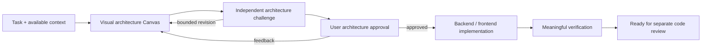

# Build It

Design and build a known task without a separate research report or a prepared
plan. This replaces Implementation Harness, whose entry point required both.

The architect inspects only the code/docs needed to design the slice. Broad
analogue research, a research artifact and a second execution plan are absent.
Missing product/API choices or critical facts use a focused non-blocking stop;
missing optional prior research or a plan does not prevent entry.

The single `reasons-canvas-architecture` Markdown artifact uses the shared
visual REASONS format: plain-language titles, Mermaid behavior/state/collaboration
views, an annotated ASCII source-change tree and a dependency/outcome graph.
No tables, copied dossiers, duplicated proof inventories or HTML-export phase.
Exact contracts, compatibility, source evidence, ownership, verification and
rollback remain explicit. Caller presentation replaces the role's default
heading order without removing its proof obligations.

Separate author/reviewer agents challenge the design with at most two attack
passes. At the loop limit, unresolved findings stay visible at the user gate;
reaching the gate is not a pass. User rejection returns to the author and then
to the same approval gate. Only explicit approval unlocks implementation.

The approved Canvas supplies disjoint backend/frontend owner zones. Parallel
branches work independently from that Canvas and repository state. Workers fix
in-scope failed checks; contradictions or required redesign stop for resolution.

The final packet is `ready_for_review`, with independent code review explicitly
`not_run`. Build It does not publish, commit, push, release or run the separate
review stage. Use SPDD for broad discovery and end-to-end review orchestration.
